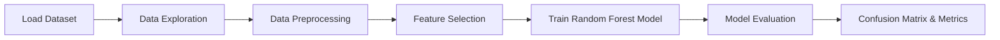

# Credit Card Fraud Detection

This project builds a machine learning model to detect fraudulent credit card transactions.

## Model Used
Random Forest Classifier

## Dataset
European cardholder transaction dataset.
### Dataset Source

The dataset used in this project is publicly available:

https://www.kaggle.com/datasets/mlg-ulb/creditcardfraud

## Transaction Distribution

The dataset is highly imbalanced, with far fewer fraudulent transactions than normal transactions.

## Transaction Amount Distribution

This histogram shows how transaction amounts are distributed across the dataset.

## Features
- Data preprocessing
- Fraud detection model
- Precision and recall evaluation
- Confusion matrix visualization

## Goal
Build a real-world AI fraud detection system.

## Dataset Explanation

The dataset used in this project contains credit card transactions made by European cardholders.

It includes both normal and fraudulent transactions collected over two days.

### Dataset Characteristics

- Total Transactions: 284,807
- Fraudulent Transactions: 492
- Fraud Percentage: 0.172%

This dataset is highly **imbalanced**, meaning fraudulent transactions are extremely rare compared to normal ones.

### Features

The dataset contains **30 features**:

- `Time` – seconds elapsed between transactions
- `Amount` – transaction amount
- `V1` to `V28` – anonymized features created using PCA transformation
- `Class` – target variable  
  - `0` → Normal Transaction  
  - `1` → Fraudulent Transaction

### Challenge

Because fraud cases are rare, the machine learning model must handle **class imbalance** effectively to detect fraud accurately.
## Model Results

After preprocessing the dataset, a **Random Forest Classifier** was trained to identify fraudulent transactions.

### Model Performance

- Accuracy: 99.96%
- Precision (Fraud Detection): 92%
- Recall (Fraud Detection): 85%
- F1 Score: 88%

### Interpretation

The model performs very well in identifying fraudulent transactions while maintaining a low number of false positives.

Since the dataset is highly imbalanced, evaluation metrics like **Precision**, **Recall**, and **F1-score** are more important than accuracy alone.

## Confusion Matrix

The confusion matrix shows the performance of the fraud detection model.

- True Negatives: 56854 (Normal transactions correctly identified)
- False Positives: 10 (Normal transactions incorrectly flagged as fraud)
- False Negatives: 46 (Fraudulent transactions missed by the model)
- True Positives: 52 (Fraudulent transactions correctly detected)

The model successfully identifies most normal transactions while still detecting a significant portion of fraudulent activity.

## Project Workflow

The fraud detection system was built using the following steps:

1. Data Collection  
   The credit card transaction dataset was loaded and inspected.

2. Data Exploration  
   A basic analysis was performed to understand the distribution of fraudulent and normal transactions.

3. Data Preprocessing  
   Missing values were checked, and the dataset was prepared for training.

4. Feature Selection  
   Relevant features such as transaction amount and anonymized PCA features were used.

5. Model Training  
   A Random Forest Classifier was trained on the dataset.

6. Model Evaluation  
   The model was evaluated using a confusion matrix, precision, recall, and F1-score.

   ## Machine Learning Pipeline

## Top 10 Important Features for Fraud Detection

   ## Technologies Used

- Python
- Pandas
- NumPy
- Scikit-learn
- Matplotlib
- Seaborn

## Future Improvements

- Use deep learning models for improved fraud detection
- Apply advanced techniques for handling class imbalance
- Deploy the model as a web application

## Conclusion

This project demonstrates how machine learning can be used to detect fraudulent credit card transactions. 

Using a Random Forest classifier, the system successfully identifies fraudulent patterns in transaction data while maintaining high accuracy on normal transactions.
